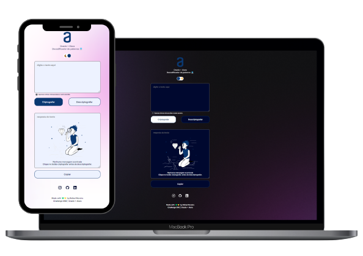

<h1 align="center"> Alura Challenge ONE | Lógica de Programação | Decodificador de texto - 2023 </h1>

  <a href="#-formacao">Formação</a>&nbsp;&nbsp;&nbsp;|&nbsp;&nbsp;&nbsp;
  <a href="#-tecnologias">Tecnologias</a>&nbsp;&nbsp;&nbsp;|&nbsp;&nbsp;&nbsp;
  <a href="#floppy_disk-projeto">Projeto</a>&nbsp;&nbsp;&nbsp;|&nbsp;&nbsp;&nbsp;
  <a href="#memo-licença">Licença</a>

  

 

  

## 💻 Formação

- Formação em programação [**ONE - Oracle Next Education**](https://www.alura.com.br/challenges/oracle-one) | Oracle + Alura

## 🚀 Tecnologias

Esse projeto foi desenvolvido com as seguintes tecnologias:

- HTML
- CSS
- JavaScript
- Git e Github

## 💾 Projeto

Aplicação que criptografa textos, utilizando as seguintes letras:

- `A letra "a" é convertida para "ai"`
- `A letra "e" é convertida para "enter"`
- `A letra "i" é convertida para "imes"`
- `A letra "o" é convertida para "ober"`
- `A letra "u" é convertida para "ufat"`

Observações:

- Funciona apenas com letras minúsculas
- Não funciona com letras com acentos nem caracteres especiais
- Converte uma palavra ou texto para a versão criptografada e retorna uma palavra ou texto criptografada para a versão original.

Exemplo:

- `"gato" => "gaitober"`
- `gaitober" => "gato"`

## 📝 Licença

- Esse projeto está sob a licença MIT

